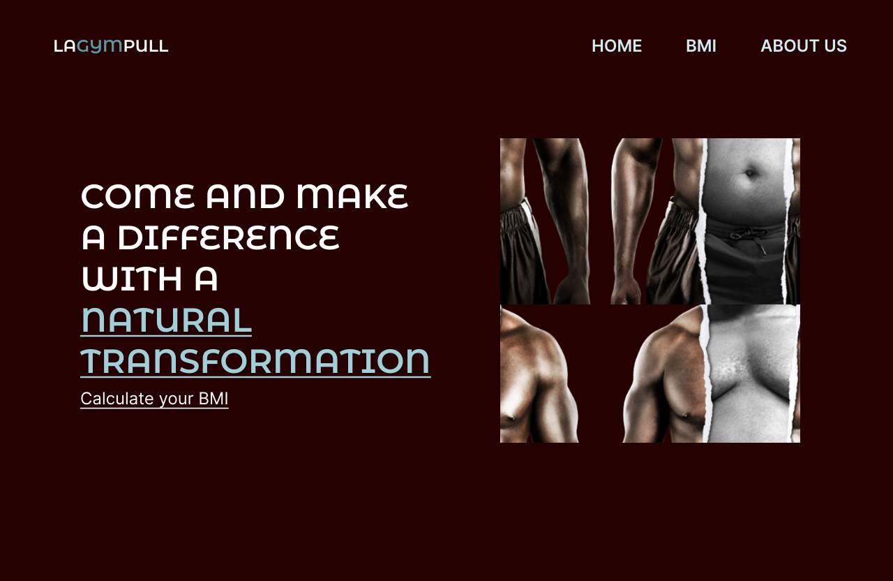

# LAGYMPULL :muscle:

> [!NOTE]
> This project is my first project in :us:	English Language. Please, send me a message if some word or sentence is wrong.

:us:
This project is mainly calculate BMI of people and show us about table and as you can avoid a not health in a form small.

All things that I write was reading articles on website and If you have more 25 scored search a doctor and avoid problems of long period.

While I developer this project I learn more about React Hooks in specific about `useState` and how it is simple to create components that do a clean code.

In the project were create 4 sections but only one have  used `useState` that was BMI section.

I used technologies: React, Next.js, Material UI, and CSS.

:brazil:	
Este projeto tem como objetivo principal calcular o IMC das pessoas e nos mostrar sobre a tabela e como você pode evitar um problema de saúde em uma forma pequena.

Tudo o que escrevi foi lendo artigos em sites e, se você tiver mais de 25 pontos, procure um médico e evite problemas de longo prazo.

Enquanto desenvolvia esse projeto, aprendi mais sobre React Hooks, especificamente sobre `useState` e como é simples criar componentes que fazem um código limpo.

No projeto, foram criadas 4 seções, mas apenas uma usou o `useState`, que foi a seção IMC.

Usei as tecnologias: React, Next.js, Material UI e CSS.

